## Create and Configure GitLab Server 

**Flow of the Steps**

Install Gitlab Server in Docker container

Search for : Install Gitlab using Docker Engine
Url result ? https://docs.gitlab.com/ee/install/docker/installation.html

1- Create a new folder 

```bash
mkdir -p /data/gitlab
```
2- run de docker command to create a GitLab Server.

```bash
 sudo docker run --detach \
   --hostname gitlabsrv \
   --publish 443:443 --publish 8080:80 --publish 22:22 \
   --name gitlab \
   --restart always \
   --volume /data/gitlab/config:/etc/gitlab \
   --volume /data/gitlab/logs:/var/log/gitlab \
   --volume /data/gitlab/data:/var/opt/gitlab \
   --shm-size 256m \
   gitlab/gitlab-ce:latest
```

To see the logs ?

```bash
sudo docker logs -f  a7d220861a1d
```

3- Configurer the GitLab local.

To see the ip you use in url for your GitLab local.

```bash
ip a
```

http://192.168.15.49:8080/users/sign_in

4- Configure user root.

Run the command to get the password for the root user.


```bash
sudo docker exec -it gitlab grep 'Password:' /etc/gitlab/initial_root_password
```

Obs. You needed to change your passowrd because you have a limit time for do this.

5- Create a new user devops

user: devops
password: ********
email: devops@example.com

```bash
git config --global user.email "devops@example.com"
git config --global user.name "devops"
```

## "Manage GitLab repositories with Terraform"

**Flow of the Steps**

1- creaste a new repository 

New repository repo_manager


http://192.168.15.49:8080/devops/repo_manager.git

Do the clone : 
```bash
git clone http://192.168.15.49:8080/devops/repo_manager.git
```

2- Create en configure the terraform files.

In the case we need two file terraform.
main.tf and var.tf

main.tf 
```yaml

terraform {
  required_providers {
    gitlab = {
      source  = "gitlabhq/gitlab"
      version = "~> 3.5"
    }
  }
}

provider "gitlab" {
  token = var.gitlab_token
  base_url = "http://192.168.15.49:8080/api/v4/"
}

# # Add a project owned by the user
resource "gitlab_project" "demo01" {
  name = "demo01"
  visibility_level = "public"
}

# Add branch protection for the project
resource "gitlab_branch_protection" "main_protection" {
  project             = gitlab_project.demo01.id
  branch              = "main" # Adjust this to the name of your default branch
  push_access_level   = "developer" # Adjust access level as needed
  merge_access_level  = "developer" # Adjust access level as needed
  unprotect_access_level = "maintainer" # Optional: who can unprotect this branch
}
```

var.tf
```yaml

variable gitlab_token {
  type        = string
  default     = "***********"
  description = "Token terraform"
}
```
3- Configure and create a token 

Create a access token for user named terraform-token

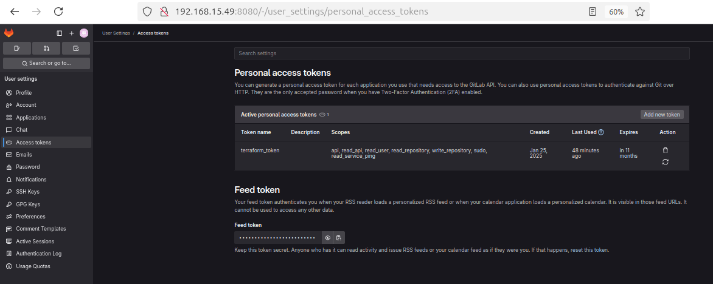


After that out this in default value in var.tf file


4- Execute terraform commands
```bash
terraform int
```
```bash
terraform plan
```
```bash
terraform apply
```

## Install GitLab Runner

Here we need other pc to install Gitlab Runner.

In my case I'll use Windows 11 to install Gitlab Runner.

Click the link https://docs.gitlab.com/runner/install/windows.html

1- Do the Download the binary for 64-bit

2- Make a new folder in a root pc c:/GitLab-Runner

3- Copy and paste the file .exe (gitlab-runner-windows-amd64)

4- Rename the file to gitlab-runner

5- Exec the pronpt with administrator 

6- Exec the commnad :

```bash
cd C:\GitLab-Runner
.\gitlab-runner.exe install
.\gitlab-runner.exe start
```

## Configure and Registry GitLab Runner
On pc that you install the Gitlab Server do then steps:

1- On a repository http://192.168.15.49:8080/devops/repo_manger go to Settings > CICD > Runners

2- In a section "Project runners" click in  `"**New project runner**"` 

3- In a new window fill the fields ( `"**Tag**"` : dind ) select `"**Run untagged jobs**"`  and click in Create runner

4- The new page will create a command:

```bash

gitlab-runner register  --url http://192.168.15.49:8080 --token glrt-t3_**********_**********

```

5- Go to the pc the you install Gitlab Runner e run the command in step (4)

6- 

```bash
PS C:\GitLab-Runner> .\gitlab-runner.exe register
Runtime platform                                    arch=amd64 os=windows pid=15468 revision=f9c5437e version=17.8.2
Enter the GitLab instance URL (for example, https://gitlab.com/):
http://192.168.15.49:8080
Enter the registration token:
glrt-t3_**********_**********
Verifying runner... is valid                        runner=t3_******
Enter a name for the runner. This is stored only in the local config.toml file:
[pc-andre]: runner-tutorial-youtube
Enter an executor: kubernetes, docker-autoscaler, instance, custom, shell, ssh, docker, docker-windows, parallels, virtualbox, docker+machine:
docker
Enter the default Docker image (for example, ruby:2.7):
alpine
Runner registered successfully. Feel free to start it, but if it's running already the config should be automatically reloaded!

Configuration (with the authentication token) was saved in "C:\\GitLab-Runner\\config.toml"
PS C:\GitLab-Runner> .\gitlab-runner.exe restart
Runtime platform                                    arch=amd64 os=windows pid=11176 revision=f9c5437e version=17.8.2
```


7- Edit the file config add a line : 

```config

clone_url = "http://192.168.15.49:8080"

```

8- Save the file.

## Create and Configure Basic Pipeline

**Flow of the Steps**

1- on a repository http://192.168.15.49:8080/devops/repo_manger go to left menu Build > Pipeline editor

2- On a `"**Create a new .gitlab-ci.yml file at the root of the repository to get started.**"` click in `Configure pipeline`

3- This will open a editor, put the script there:

```yalm

job01:
    script:
        - echo "Hello terraform Users"

```

4- Click in `Commit changes`

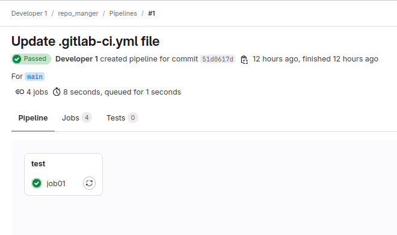

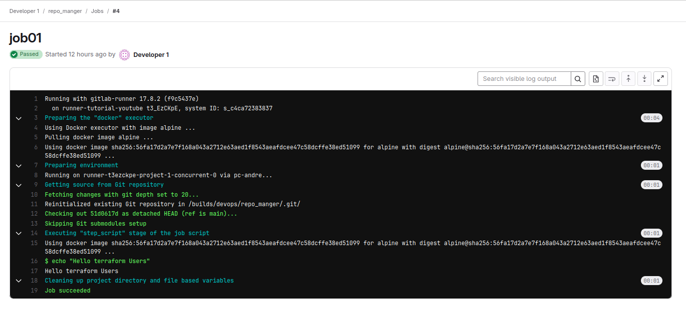


5- Now we'll create a new job. This job will create a folder and a file 


```yalm

job01:
    script:
        - echo "Hello terraform Users"

job02:
    script:
        - mkdir test
        - cd test
        - touch teste01.txt
        - echo line >> test01.txt
```

Click in `Commit changes`

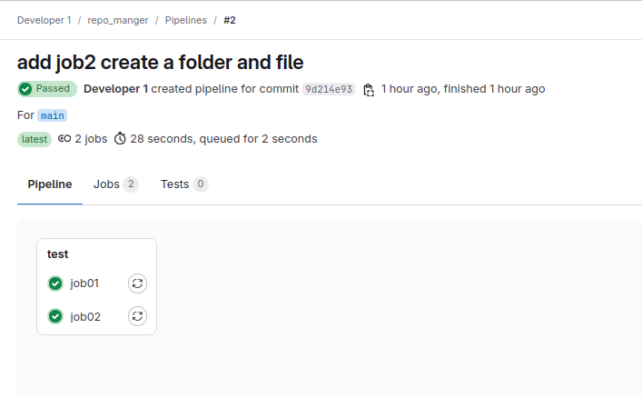


6- Jobs runnedin stages

```yalm

stages:
    - stage_one
    - stage_two

job01:
    stage: stage_one
    script:
        - echo "Hello terraform Users"

job02:
    stage: stage_two
    script:
        - mkdir test
        - cd test
        - touch teste01.txt
        - echo line >> test01.txt

```

Click in `Commit changes`

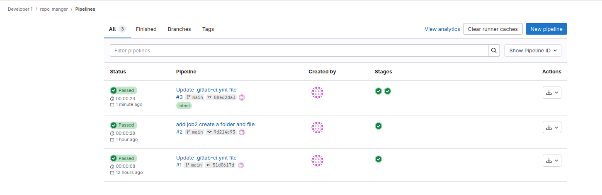

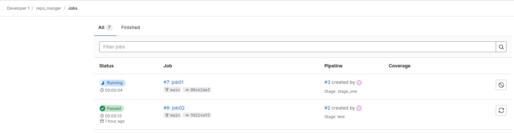

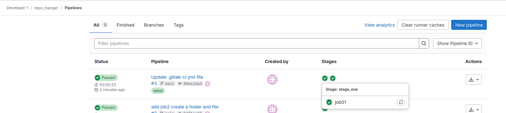

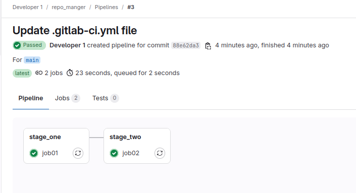


7- runnung two jobs in one stage

```yalm

stages:
    - stage_one
    - stage_two

job01:
    stage: stage_one
    script:
        - echo "Hello terraform Users"

job02:
    stage: stage_one
    script:
        - mkdir test
        - cd test
        - touch teste01.txt
        - echo line >> test01.txt

job03:
    stage: stage_two
    script:
        - echo "Stage Two"

```

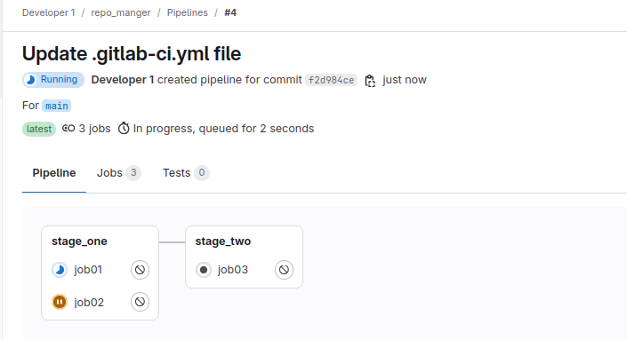

! Every time when job start it create a new container executed the script and detroy container.

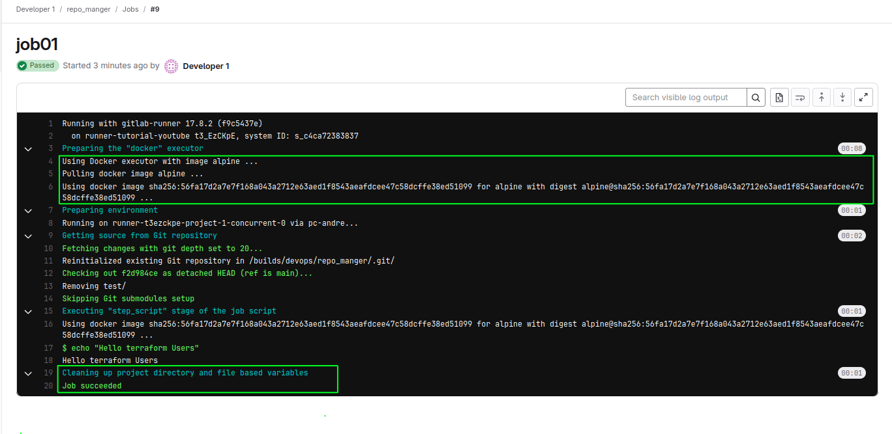

what happend if stage_two needed a result from stage_one?

Docker container are not persists the result 

As a result the information are lost.

How can we access the resolve?

`"**Artifacts are files that are produced by a step. Once you've defined them in your pipeline configuration, you can share them with a following step or export them to keep the artifacts after a step completes.**"`

8- Show the content teste01.txt file in stage_two

Befoe we implement te artifact we'll do a test

```yalm

stages:
    - stage_one
    - stage_two

job01:
    stage: stage_one
    script:
        - echo "Hello terraform Users"

job02:
    stage: stage_one
    script:
        - mkdir test
        - cd test
        - touch teste01.txt
        - echo line >> test01.txt

job03:
    stage: stage_two
    script:
        - cat test/teste01.txt

```

Put the code in pipeline editor 

Click in `Commit changes`

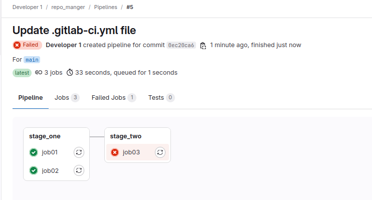


```yalm

stages:
    - stage_one
    - stage_two

job01:
    stage: stage_one
    script:
        - echo "Hello terraform Users"

job02:
    stage: stage_one
    script:
        - mkdir test
        - cd test
        - touch teste01.txt
        - echo line >> test01.txt
    artifacts:
        paths:
            - test

job03:
    stage: stage_two
    script:
        - cat test/teste01.txt

```

Click in `Commit changes`

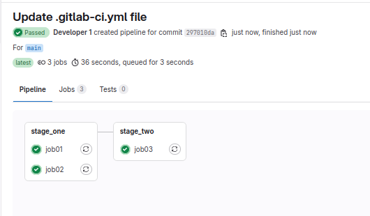

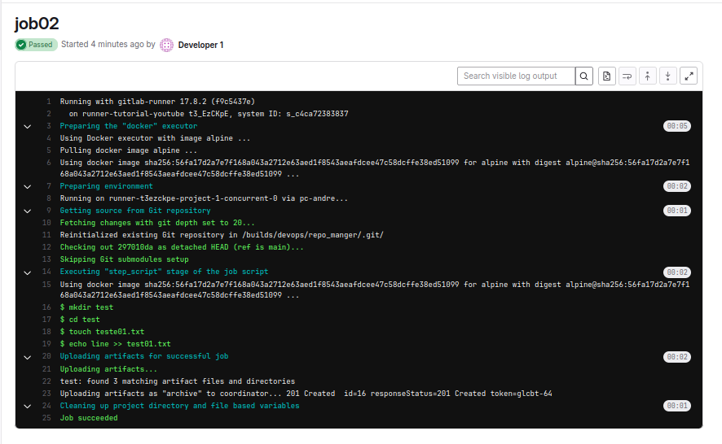

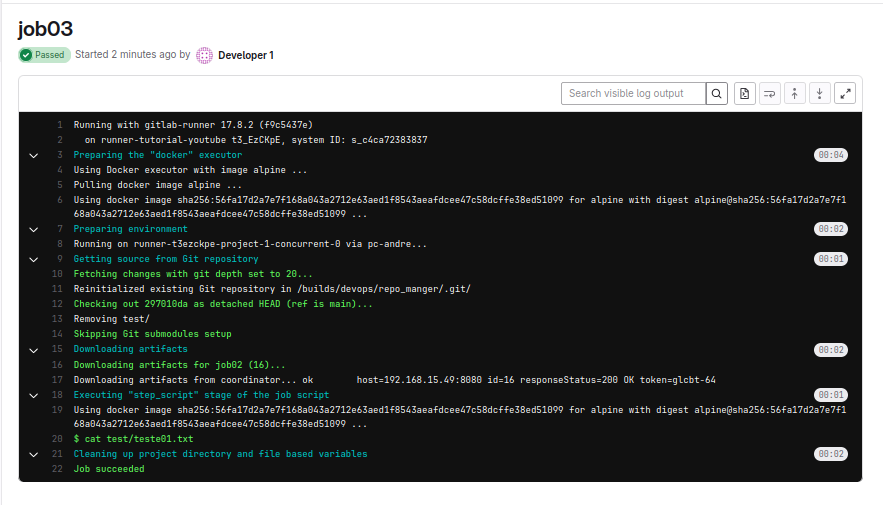

## Terraform with Pipeline Stages

When we `"**Install GitLab Runner**"` we configure GitLab Runner using a image alpine.


```bash
PS C:\GitLab-Runner> .\gitlab-runner.exe register
Runtime platform                                    arch=amd64 os=windows pid=15468 revision=f9c5437e version=17.8.2
Enter the GitLab instance URL (for example, https://gitlab.com/):
http://192.168.15.49:8080
Enter the registration token:
glrt-t3_**********_**********
Verifying runner... is valid                        runner=t3_******
Enter a name for the runner. This is stored only in the local config.toml file:
[pc-andre]: runner-tutorial-youtube
Enter an executor: kubernetes, docker-autoscaler, instance, custom, shell, ssh, docker, docker-windows, parallels, virtualbox, docker+machine:
docker
Enter the default Docker image (for example, ruby:2.7):
alpine
Runner registered successfully. Feel free to start it, but if it's running already the config should be automatically reloaded!

Configuration (with the authentication token) was saved in "C:\\GitLab-Runner\\config.toml"
PS C:\GitLab-Runner> .\gitlab-runner.exe restart
Runtime platform                                    arch=amd64 os=windows pid=11176 revision=f9c5437e version=17.8.2
```

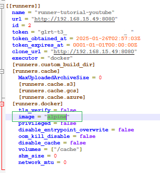

Now let's implement some changes on a pipeline file .gitlab-ci.yml 


```yaml

# stages:
#     - stage_one
#     - stage_two

# job01:
#     stage: stage_one
#     script:
#         - echo "Hello terraform Users"

# job02:
#     stage: stage_one
#     script:
#         - mkdir test
#         - cd test
#         - touch teste01.txt
#         - echo line >> test01.txt
#     artifacts:
#         paths:
#             - test

# job03:
#     stage: stage_two
#     script:
#         - cat test/teste01.txt


stages:
    - init
    - plan
    - apply

variables:
  ADDRESS: "http://192.168.56.10:8080/api/v4/projects/2/terraform/state"
  PROJECT_NAME: "demo02"
  USER_NAME: "devops"
  TOKEN: "glpat-"

image:
    name: hashicorp/terraform

init_step:
  stage: init
  script:
    - terraform init \
      -backend-config="$ADDRESS/$PROJECT_NAME" \
      -backend-config="lock_address=$ADDRESS/$PROJECT_NAME/lock" \
      -backend-config="unlock_address=$ADDRESS/$PROJECT_NAME/lock" \
      -backend-config="username=$USER_NAME" \
      -backend-config="password=$TOKEN" \
      -backend-config="lock_method=POST" \
      -backend-config="unlock_method=DELETE" \
      -backend-config="retry_wait_min=5" \
      --reconfigure

init_job:
    stage: init
    script:
        - terraform init

plan_job:
    stage: plan
    script:
        - terraform plan

apply_job:
    stage: apply
    script:
        - terraform apply

```

Click in `Commit changes`

The step init_job Failed, why?


`"**Terraform has no command named "sh".**"`

to solve this problema we neeed to add the `"**entrypoint[""]**"`

The entrypoint is used to specify the command executed them the container is started

Go to add entrypoint[""] in the pipeline file .gitlab-ci.yml 

```yaml

# stages:
#     - stage_one
#     - stage_two

# job01:
#     stage: stage_one
#     script:
#         - echo "Hello terraform Users"

# job02:
#     stage: stage_one
#     script:
#         - mkdir test
#         - cd test
#         - touch teste01.txt
#         - echo line >> test01.txt
#     artifacts:
#         paths:
#             - test

# job03:
#     stage: stage_two
#     script:
#         - cat test/teste01.txt


stages:
    - init
    - plan
    - apply

variables:
  ADDRESS: "http://192.168.56.10:8080/api/v4/projects/2/terraform/state"
  PROJECT_NAME: "demo02"
  USER_NAME: "devops"
  TOKEN: "glpat-"

image:
    name: hashicorp/terraform
    entrypoint: [""]

init_step:
  stage: init
  script:
    - terraform init \
      -backend-config="$ADDRESS/$PROJECT_NAME" \
      -backend-config="lock_address=$ADDRESS/$PROJECT_NAME/lock" \
      -backend-config="unlock_address=$ADDRESS/$PROJECT_NAME/lock" \
      -backend-config="username=$USER_NAME" \
      -backend-config="password=$TOKEN" \
      -backend-config="lock_method=POST" \
      -backend-config="unlock_method=DELETE" \
      -backend-config="retry_wait_min=5" \
      --reconfigure

init_job:
    stage: init
    script:
        - terraform init

plan_job:
    stage: plan
    script:
        - terraform plan

apply_job:
    stage: apply
    script:
        - terraform apply

```

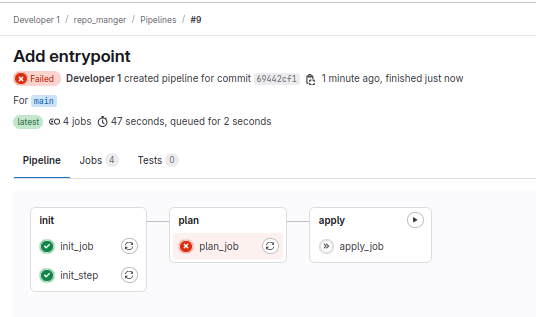


This error ocorrer because docker container going and no have result transfer to the second one.

Link in a case of `"**artifacts**"`, but here every step needed the init step!

But to solve this problemas we'll change the file .gitlab-ci.yml 


##  "kubernetes-gitlab-cicd" 

Step 1

- Create Repo `"k8s-data"` on GitLab
- Create Repo `"k8s-Connection"` on GitLab
- Create Agent on GitLab
- Install GitLab Agent on K8S Cluster
- Register Connection between K8S and GitLab

Step 2
- Create K8S Manifests for our project
- Create image and push it to GitLab Container Registry
- Push Project’s Data on Repo `"k8s-Connection"`
Run final CI/CD

**Flow of the Steps**


Step 1

Create Repo `"k8s-Connection"` on GitLab 

Create Agent on GitLab

Search in google: integrate kubernetes cluster with gitlab (https://docs.gitlab.com/ee/user/clusters/agent/) 
To connect a Kubernetes cluster to GitLab, you must first install an agent in your cluster. (https://docs.gitlab.com/ee/user/clusters/agent/install/index.html)

**Go to** : Create an agent configuration file

* In the repository `"k8s-Connection"`, in the default branch, create an agent configuration file at: 

`.gitlab/agents/<agent-name>/config.yaml`

(This file we'll define witch group,username and repository cam acess the kubernetes cluster )

`.gitlab/agents/k8s-Connection/config.yaml`

add in file this code
```yml
ci_access:
    groups:
    - id: dev-ops-group3
    projects:
    - id: dev-ops-group3/k8s-data
```
        
Install GitLab Agent on K8S Cluster

Access GitLab: 
    Log in to your GitLab instance and navigate to the project or group where you want to integrate the Kubernetes cluster.

Enable the GitLab Agent:

- Go to Operate > Kubernetes Clusters.
- Select Connect a Cluster (Agent).
- Click on Install a new agent.


Generate an Agent Configuration file. 

This will be used later in your Kubernetes cluster.

* in gitlad repository , go to Operate > Kubernetes clusters.
* Agent Access Token : <YOUR-TOKEN>
* Helm Script :
```bash
helm repo add gitlab https://charts.gitlab.io
helm repo update
helm upgrade --install k8s-Connection gitlab/gitlab-agent \
    --namespace gitlab-agent-k8s-Connection \
    --create-namespace \
    --set config.token=<YOUR-TOKEN> \
    --set config.kasAddress=wss://kas.gitlab.com
```

Register Connection between K8S and GitLab
Exec all commands in terminal 
```bash
helm repo add gitlab https://charts.gitlab.io
helm repo update
helm upgrade --install k8s-Connection gitlab/gitlab-agent \
    --namespace gitlab-agent-k8s-Connection \
    --create-namespace \
    --set config.token=<YOUR-TOKEN> \
    --set config.kasAddress=wss://kas.gitlab.com
```

Step 2

Create K8S Manifests for our project

1- Create file `.gitlab-ci.yml` in `"k8s-data"` repository

2- For config this new file Search in google: gitlab container registry cicd (https://docs.gitlab.com/ee/user/packages/container_registry/build_and_push_images.html)


3- Implement Build Image

```yaml
variables:
    REGISTRY_URL: registry.gitlab.com # GitLab Container Registry URL
    REGISTRY_USERNAME: $CI_REGISTRY_USER # Predefined GitLab CI/CD variable
    REGISTRY_PASSWORD: $CI_REGISTRY_PASSWORD # Predefined GitLab CI/CD variable

stages:
    - build

build_image:
    image: docker
    stage: build
    services:
    - docker:dind
    script:
    - echo "$CI_REGISTRY_PASSWORD" | docker login $CI_REGISTRY -u $CI_REGISTRY_USER --password-stdin
    - docker build -t $CI_REGISTRY/dev-ops-group3/k8s-data/sample:v1 .
    - docker push $CI_REGISTRY/dev-ops-group3/k8s-data/sample:v1

```
4- Create manifest file


a) **POD** Manifest 

```bash
kubectl run login-app --image=registry.gitlab.com/dev-ops-group3/k8s-data/sample:v1 --dry-run=client -o yaml > pod.yaml
```
`**This command will create a Manifest based on the parameters of the command kubectl**`

```bash 
vim pod.yaml
```
    
- Copy content in vim
    
```bash
"*y
```
    
- Result :
    
```yaml

apiVersion: v1
kind: Pod
metadata:
    labels:
    run: login-app
    name: login-app
spec:
    containers:
    - image: registry.gitlab.com/dev-ops-group3/k8s-data/sample:v1
    name: login-app
    restartPolicy: Always
    imagePullSecrets:
    - name: app-secret

```
b) **SERVICE** Manifest 

```bash
kubectl create svc nodeport login-svc --tcp=80:80 --dry-run=client -o yaml > loginsvc.yaml
```
`**This command will create a Manifest based on the parameters of the command kubectl**`

```bash 
vim loginsvc.yaml
```
- Copy content in vim

```bash
"*y
```

- Result :

```yaml
apiVersion: v1
kind: Service
metadata:
    labels:
    app: login-svc
    name: login-svc
spec:
    selector:
    run: login-app
    ports:
    - name: http
    port: 80
    targetPort: 80
    protocol: TCP
    type: NodePort

```
c) Add Create **SECRET** Command (app-secret) in .gitlab-ci.yml 

```yaml
variables:
    KUBE_CONTEXT: dev-ops-group3/k8s-Connection:k8s-Connection
    REGISTRY_URL: registry.gitlab.com # GitLab Container Registry URL
    REGISTRY_USERNAME: $CI_REGISTRY_USER # Predefined GitLab CI/CD variable
    REGISTRY_PASSWORD: $CI_REGISTRY_PASSWORD # Predefined GitLab CI/CD variable

stages:
    - build
    - deploy

build_image:
    image: docker
    stage: build
    services:
    - docker:dind
    script:
    - echo "$CI_REGISTRY_PASSWORD" | docker login $CI_REGISTRY -u $CI_REGISTRY_USER --password-stdin
    - docker build -t $CI_REGISTRY/dev-ops-group3/k8s-data/sample:v1 .
    - docker push $CI_REGISTRY/dev-ops-group3/k8s-data/sample:v1

deploy_project:
    stage: deploy
    image:
    name: bitnami/kubectl:latest
    entrypoint: ['']
    script:
    # Set Kubernetes context
    - kubectl config use-context $KUBE_CONTEXT
    
    # Create GitLab Container Registry secret
    - kubectl create secret docker-registry app-secret --docker-server=$REGISTRY_URL --docker-username=$REGISTRY_USERNAME --docker-password=$REGISTRY_PASSWORD --dry-run=client -o yaml | kubectl apply -f -

    # Apply Kubernetes manifests
    - kubectl apply -f $CI_PROJECT_DIR/k8s-files/
    
    # Verify deployment
    - kubectl get pods
    - kubectl get services

```
    
Push Project’s Data on Repo k8s-data

1- Create folder [k8s-files] in files [pod.yaml,loginsvc.yaml]

2- put de result of all (Create manifest file) in our respective item 

```bash
git add .
git commit -m "Add all manifest files"
git push
```

Create image and push it to GitLab Container Registry


Run final CI/CD


